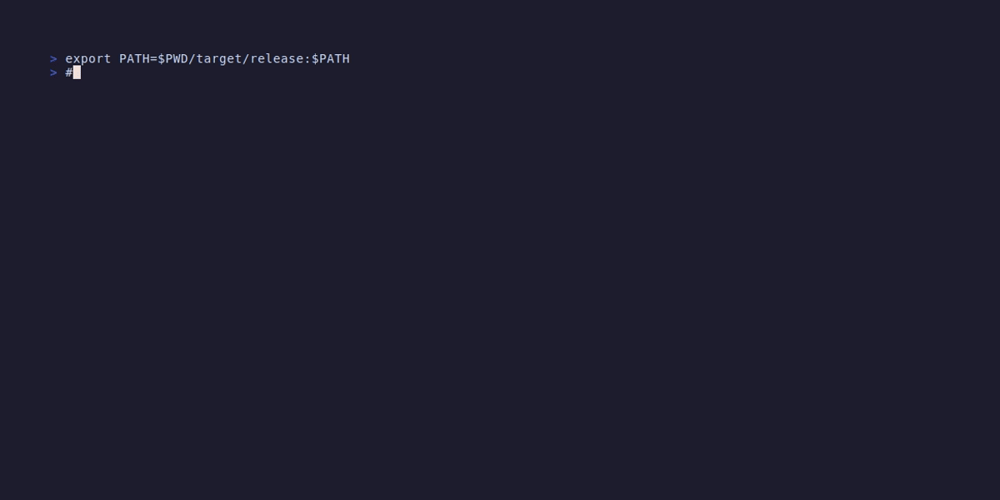

# Zen

An advanced CLI learning tool powered by three core principles:
1. **Active Recall** - Test yourself instead of passive review
2. **Spaced Repetition** - FSRS algorithm for optimal scheduling
3. **Cognitive Load** - LLM-powered evaluation and ideal answers

## Demo

### Create a new flashcard


### Find and edit cards with fuzzy search


### Review session with FSRS scheduling


## Features

- **Simple card creation**: Create flashcards directly from the command line
- **Question-answer format**: Focus on what matters - questions and answers
- **FSRS algorithm**: Uses the modern Free Spaced Repetition Scheduler for optimal learning
- **Interactive review sessions**: TUI-based review with real-time interval previews
- **Semantic answer validation**: BERT-based similarity scoring for evaluating answer quality
- **Statistics dashboard**: Track your learning progress with detailed statistics
- **Fuzzy search**: Find and edit cards with interactive fuzzy matching
- **CLI-first**: All interactions through the terminal
- **Easy editing**: Cards stored as simple markdown files
- **Efficient storage**: Hybrid approach with markdown for content and SQLite for scheduling

## Installation

```bash
cargo install --git https://github.com/hamzamohdzubair/zen
```

Or clone and build from source:

```bash
git clone git@github.com:hamzamohdzubair/zen.git
cd zen
cargo build --release
```

## Usage

### Create a new card

```bash
zen new what is the relationship between vpc and vm in google cloud
```

You'll be prompted to enter the answer (multi-line supported). Press Enter twice to finish.

### Find and edit cards

```bash
zen find google cloud    # Fuzzy search for cards
zen f google cloud       # Short alias
```

Opens an interactive fuzzy finder. Type to filter cards, use arrows/Tab to navigate, press Enter to edit in your default editor.

### Start a review session

```bash
zen start
```

Reviews all cards that are due:
- Press `Space` or `Enter` to reveal the answer
- BERT semantic similarity score shows how close your answer is to the expected answer
- Rate your recall: `1` (Again), `2` (Hard), `3` (Good), `4` (Easy)
- Each rating shows the next review interval (e.g., 10m, 3d, 8d, 21d)
- Progress indicator shows your position (Card 3/10)
- Summary statistics displayed at the end

### Show statistics

```bash
zen stats                # Show review statistics and progress
```

### List all cards (coming soon)

```bash
zen list                 # List all cards
```

## Card Storage

Cards are stored in `~/.zen/`:

- **Content**: `~/.zen/cards/*.md` - Simple markdown files
- **Metadata**: `~/.zen/zen.db` - SQLite database for scheduling

### Card Format

Cards use a minimal format:

```
What is your question?

---

This is the answer.
```

Everything before `\n\n---\n\n` is the question, everything after is the answer.

## Roadmap

- [x] **Phase 1**: Basic card creation and storage
- [x] **Phase 2**: Fuzzy search and editing with TUI
- [x] **Phase 3**: Review sessions with FSRS scheduling
- [x] **Phase 4**: Statistics and polish
- [ ] **Phase 5**: Additional features and refinements

See [DESIGN.md](DESIGN.md) for detailed feature planning.

## How Reviews Work (FSRS)

Zen uses the FSRS (Free Spaced Repetition Scheduler) algorithm to optimize your review schedule:

1. **New cards** start with short intervals (minutes to days)
2. **Each rating** updates the card's memory parameters:
   - **Stability**: How long the memory lasts
   - **Difficulty**: The card's inherent difficulty
   - **Retrievability**: Your current memory strength
3. **Next review date** is calculated to maintain 90% retention probability
4. **Four rating options**:
   - `1 - Again`: Failed recall (review soon, ~10m)
   - `2 - Hard`: Difficult recall (~3d)
   - `3 - Good`: Correct with effort (~8d)
   - `4 - Easy`: Perfect recall (~21d)

Intervals shown are examples for new cards. The algorithm adapts based on your actual performance history.

## Semantic Answer Validation

During review sessions, Zen uses BERT-based semantic similarity scoring to help you evaluate your answers:

- **Automatic scoring**: After revealing the answer, your typed response is compared to the expected answer
- **Similarity score**: Ranges from 0-100%, measuring semantic meaning (not exact word matching)
- **Color-coded feedback**:
  - 🟢 Green (≥80%): Excellent match
  - 🟡 Yellow (60-79%): Good understanding
  - 🟠 Orange (40-59%): Partial understanding
  - 🔴 Red (<40%): Needs review
- **Fallback**: If BERT model isn't available, scoring gracefully falls back to manual evaluation

The scoring is advisory - you still choose the final rating based on your actual recall.

## Design Principles

- **No full-screen interfaces**: All TUIs are max half-terminal height
- **Vim-like navigation**: Ctrl+j/k for movement
- **No quotes needed**: Natural command syntax
- **Easy editing**: Edit cards in your favorite editor
- **Non-invasive**: Minimal, focused interface

## Development

### Build

```bash
cargo build --release
```

### Test

```bash
cargo test
```

### Run

```bash
cargo run -- new your question here
```

## License

Licensed under either of [Apache License, Version 2.0](LICENSE-APACHE) or [MIT license](LICENSE-MIT) at your option.
